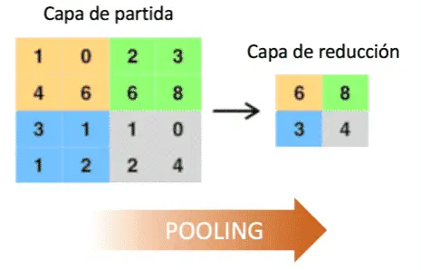

# Redes Convolucionales

Las redes neuronales convolucionales (CNN o ConvNet), son un caso especial de redes donde los parámetros de aprendizaje son los filtros (kernels) de convolución de los datos. Este mecanismo permite disminuir la cantidad de parámetros a entrenar porque un filtro de convolución guarda la información de un subconjunto de datos.

Supogamos un caso bidimensional, donde una capa de entrada es una imagen(matriz bidimensional), una CNN aplica varios kernels de convolución sobre la imagen como se muestra en la figura siguiente:

Al aplicar una convolución de un filtro $K$ de tamaño $(k\times l)$ sobre una matriz $M$ de $(m\times n)$ elementos, el resultado $(M\circ K)$ tendrá $(m-k, n-l)$ elementos. Si lo que se busca es preservar el tamaño de la imagen, reducirla, o alterar la manera de realizar estas convoluciones, existen dos operaciones muy populares denominadas __*padding*__ y __*stride*__.

> padding: agregado de elementos 

Estas capas de filtros pueden agruparse y apilarse al igual que en las redes neuronales densas que ya hemos visto. Para hacer apilados se suelen utilizar técnicas de reducción de dimensionalidad de manera análoga a 

